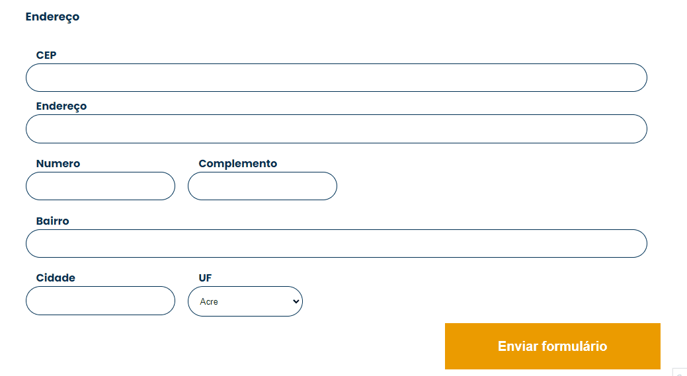

<h1 id="top"> JavaScript: consumindo e tratando dados de uma API | Alura </h1>

Repositório parcialmente desenvolvido durante o curso "JavaScript: Consumindo e tratando dados de uma API" da Alura Cursos Online.

<h2>:books: Conteúdo do curso </h2>
  
Event Loop, Call Stack e Task Queue • Callbacks • Fetch API • Promises • Then, catch e finally •  Async Await • Promise All • Manipulação do DOM • Experiência do usuário

<h2>:file_folder: Projeto AluraBook </h2> 
  
Para este projeto temos uma página de formulário de cadastro de clientes da AluraBook, um e-commerce fictício de livros técnicos.

  
Neste formulário é possível cadastrar um mesmo endereço de várias formas. E para corrigir isso usamos a API do ViaCEP, que permite que os dados sejam preenchidos automaticamente a partir do CEP. 

  
Também foi realizado o tratamento de erros como CEPs com formato inválido e inexistentes. E para finalizar foi aplicada uma mensagem de erro para melhorar a exeperiência dos usuários.

  

<h2>:computer: Tecnologias utilizadas</h2> 
  

    
    
    
   

